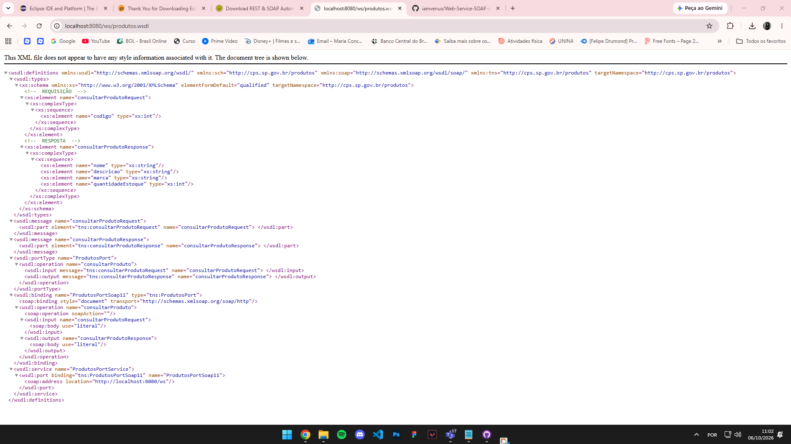
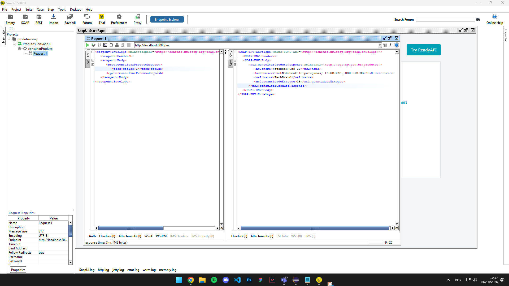
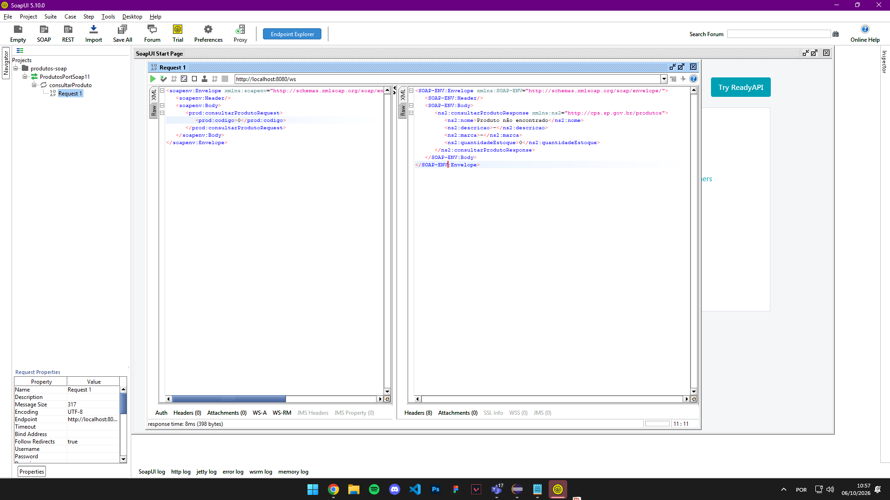

# Web Service SOAP de Produtos

Web Service SOAP (Contract First) feito com Java 17, Spring Boot e Spring Web Services.
Recebe o código de um produto e devolve nome, descrição, marca e quantidade em estoque.

## Como executar
1. Abra o projeto no Eclipse (File > Import > Maven > Existing Maven Projects).
2. Execute `ProdutosSoapApplication.java` (Run As > Java Application).
3. Acesse o WSDL: http://localhost:8080/ws/produtos.wsdl

## Produtos cadastrados
| Código | Nome | Marca | Estoque |
|---|---|---|---|
| 1 | Notebook Pro 15 | TechBrand | 25 |
| 2 | Mouse Sem Fio | ClickMax | 150 |
| 3 | Teclado Mecânico | KeyPro | 40 |

## WSDL

## Teste no SoapUI
Produto encontrado (código 1):

Produto inexistente (código 99):

